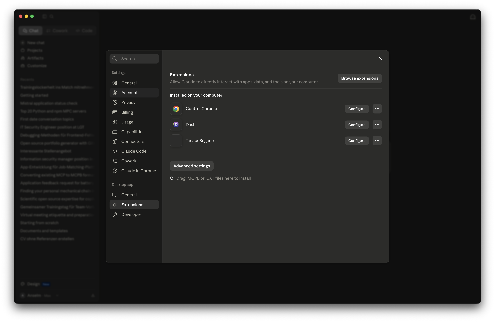
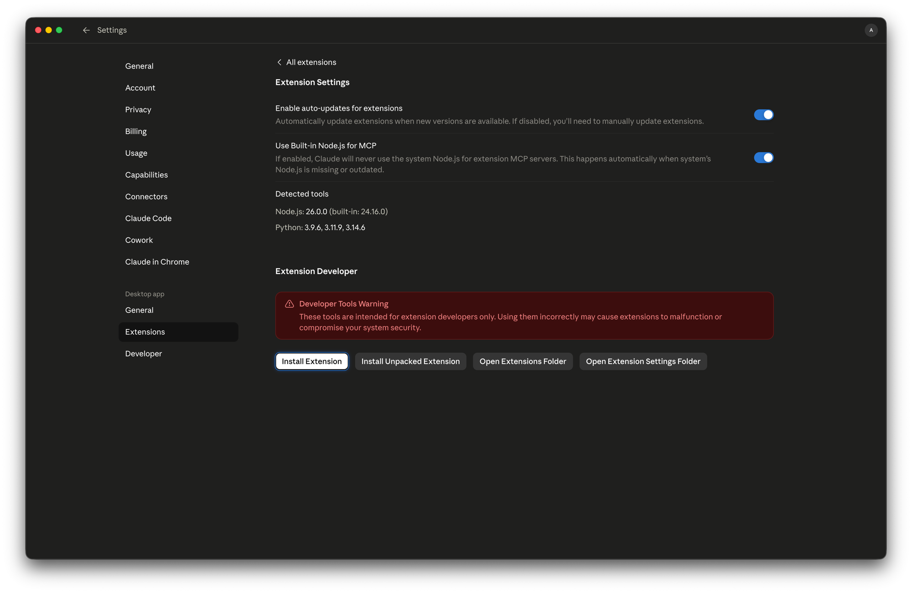

# mcp2mcpb

> Convert [PyPI](https://pypi.org) / [npm](https://www.npmjs.com) MCP servers into
> one-click `.mcpb` bundles for [Claude Desktop](https://claude.ai/download).

[](https://www.python.org/downloads/)
[](LICENSE)
[](https://pypi.org/project/mcp2mcpb/)

---

## What is `.mcpb`?

[Claude Desktop](https://claude.ai/download) has a built-in **Extensions** panel
that lets you install [MCP](https://modelcontextprotocol.io) servers with a single
drag-and-drop or button click — no manual `claude_desktop_config.json` editing
required. The file format powering that experience is `.mcpb`.

| Extensions panel | Install options |
|:---:|:---:|
|  |  |

A `.mcpb` file is a ZIP archive containing the server's files together with a
`manifest.json`. Drop it onto the Extensions panel (or click **Install Extension**)
and Claude Desktop configures and launches the MCP server automatically.
The format is specified by the
[Model Context Protocol bundle spec](https://github.com/modelcontextprotocol/mcpb).

**`mcp2mcpb` bridges the gap between the existing PyPI/npm ecosystem and the `.mcpb`
install experience.** It works in two directions:

- **On-demand conversion** — give it any published package name and it emits a
  ready-to-install `.mcpb` bundle in seconds.
- **Continuous publishing** — a reusable [GitHub Action](#github-action) and
  upstream-polling workflows keep bundles in sync with new upstream releases.

---

## Installation

```bash
# via uv (recommended)
uv pip install mcp2mcpb

# via pip
pip install mcp2mcpb
```

Requires [Python](https://www.python.org/downloads/) 3.12+ and
[uv](https://docs.astral.sh/uv/) (for `uvx`-based reference bundles and
dependency vendoring).

---

## Usage

Three ways to drive `mcp2mcpb`: **CLI flags**, a **config file**, or the
**GitHub Action**.

### Command line — with flags

```bash
# Convert a published MCP server into a .mcpb bundle
mcp2mcpb mcp-server-fetch \
    --registry pypi \      # -r : pypi | npm
    --pin 1.2.0 \          # -v : omit for the latest release
    --mode complete \      # -m : complete (vendor deps) | reference (uvx/npx)
    --output dist/         # -o : output directory

# Print the version
mcp2mcpb --version
```

When auto-detection isn't enough, spell out the launch recipe explicitly and skip
the `--help` probe:

```bash
mcp2mcpb serena-agent \
    --entry-script serena --subcommand "start-mcp-server" \
    --mode reference --no-probe
```

Recipe flags — `--runner`, `--entry-script`, `--extra` (repeatable),
`--subcommand`, `--transport`, `--no-probe` — are documented under
[Launch recipe](#launch-recipe). Add `--verbose` to see the resolved recipe and
which config file was read:

```console
$ mcp2mcpb repo-release-tools --extra mcp --entry-script rrt-mcp \
      --transport stdio --mode reference --no-probe --verbose
→ Config file: none
→ Resolved launch recipe — runner=uvx, entry_script=rrt-mcp, extras=['mcp'], subcommand=[], transport=stdio
```

### Command line — with a config file

Put the recipe in a `.mcpb.toml` (read from the current working directory) or a
`[tool.mcpb]` table in `pyproject.toml` so you don't repeat flags on every run:

```toml
# .mcpb.toml
version      = "1.9.0"    # optional; omit or "latest" → latest (--pin wins)
runner       = "uvx"      # optional; inferred from registry+mode if omitted
entry-script = "rrt-mcp"
extras       = ["mcp"]
subcommand   = ["start-mcp-server"]
transport    = "stdio"
from         = true        # optional; force/suppress uvx --from
```

```bash
mcp2mcpb repo-release-tools --mode reference   # name only — the rest comes from the file
```

A few things worth knowing:

- **`runner` is inferred** from `registry` + `mode` when omitted —
  `(pypi, reference) → uvx`, `(npm, reference) → npx`,
  `(pypi, complete) → python`, `(npm, complete) → node`
  (see [Bundle modes](#bundle-modes)). Set `runner` only to override.
- **`from` is auto-derived** for [uvx](https://docs.astral.sh/uv/concepts/tools/):
  used when `extras` are set **or** `entry-script` differs from the package name.
  Set `from = true|false` only for edge cases.
- **`version`** is the one piece of package identity a config file can carry.
  Precedence: **`--pin` (CLI) > config `version` > latest**. In-package config
  cannot set the version (the version is needed to fetch the package).

The recipe keys (`runner`, `entry-script`, `extras`, `subcommand`, `transport`,
`from`) can also ship **inside** the package itself (a bundled `mcpb.toml`, or a
`"mcpb"` key in `package.json` for npm) so that even third-party conversions
resolve the correct launch command. Full precedence chain:
[Launch recipe](#launch-recipe). Pass `--verbose` to see the resolved recipe, the
effective version, and which config file was read.

### GitHub Action

Add one step to your release workflow to get `.mcpb` bundles automatically:

```yaml
jobs:
  bundle:
    runs-on: ubuntu-latest
    permissions:
      contents: write
    steps:
      - uses: Anselmoo/mcp2mcpb@v1
        with:
          package: mcp-server-fetch   # your published package
          registry: pypi              # pypi | npm
          mode: complete              # complete | reference
```

On a `release` event the action attaches the produced `.mcpb` files to the GitHub
release. For platform-specific Python bundles, run it in a matrix across
`ubuntu-latest`, `macos-13`, `macos-latest`, and `windows-latest`.

Or adopt the reusable workflow at the **job** level:

```yaml
jobs:
  bundle:
    uses: Anselmoo/mcp2mcpb/.github/workflows/build-mcpb.yml@v1
    permissions:
      contents: write
    with:
      package: mcp-server-fetch
      registry: pypi
      mode: complete
```

Both accept the optional launch-recipe inputs `runner`, `entry-script`, `extras`,
`subcommand`, `transport`, and `no-probe`
(see [Launch recipe](#launch-recipe)). Omit them and the converter auto-detects
from the package.

### Inspect a bundle

`mcp2mcpb unpack` extracts a `.mcpb` to a sibling folder (or `--output DIR`) and
pretty-prints its `manifest.json` — handy for verifying the resolved launch command
and what a bundle ships:

```bash
mcp2mcpb unpack dist/repo-release-tools-1.9.0-universal.mcpb
# → Extracted to dist/repo-release-tools-1.9.0-universal/
# → prints manifest.json
```

### Sandbox — simulate Claude Desktop

Before shipping a bundle, verify it actually starts and speaks
[MCP](https://modelcontextprotocol.io) correctly:

```bash
mcp2mcpb sandbox dist/my-server-1.0.0-universal.mcpb
```

The sandbox:

1. Extracts the bundle to a temporary directory.
2. Resolves manifest placeholders (`${__dirname}`, `${user_config.some_key}`);
   prompts interactively for required `user_config` values when stdin is a TTY.
3. Launches the process and streams its stderr.
4. Performs the MCP `initialize` handshake.
5. Sends `notifications/initialized` and queries `tools/list`.
6. Verifies clean EOF shutdown when stdin is closed.

Pass environment overrides directly:

```bash
mcp2mcpb sandbox dist/my-server-1.0.0-universal.mcpb --env API_KEY=secret_val
```

With no path argument, `mcp2mcpb sandbox` auto-detects: it looks for a single
`.mcpb` file in `dist/`, then falls back to a `manifest.json` in the current
directory.

---

## Examples

<details>
<summary><b>serena</b> — a PyPI server behind a subcommand (<code>serena-agent</code>)</summary>

<br>

[Serena](https://github.com/oraios/serena) exposes its MCP server through the
`serena start-mcp-server` subcommand, so the recipe needs an explicit
`--entry-script` and `--subcommand`:

```bash
mcp2mcpb serena-agent \
    --registry pypi --mode reference \
    --entry-script serena --subcommand "start-mcp-server" --no-probe
```

```yaml
- uses: Anselmoo/mcp2mcpb@v1
  with:
    package: serena-agent
    registry: pypi
    mode: reference
    entry-script: serena
    subcommand: start-mcp-server
```

Resolves to `uv tool run --from serena-agent serena start-mcp-server`.

</details>

<details>
<summary><b>sequential-thinking</b> — a scoped npm server
(<code>@modelcontextprotocol/server-sequential-thinking</code>)</summary>

<br>

The [sequential-thinking](https://github.com/modelcontextprotocol/servers/tree/main/src/sequentialthinking)
server is published to [npm](https://www.npmjs.com) and needs no recipe overrides —
auto-detection is sufficient:

```bash
mcp2mcpb @modelcontextprotocol/server-sequential-thinking \
    --registry npm --mode reference
```

```yaml
- uses: Anselmoo/mcp2mcpb@v1
  with:
    package: "@modelcontextprotocol/server-sequential-thinking"
    registry: npm
    mode: reference
```

Resolves to `npx -y @modelcontextprotocol/server-sequential-thinking`.

</details>

<details>
<summary><b>fetch</b> — an official PyPI server, no overrides (<code>mcp-server-fetch</code>)</summary>

<br>

The reference [fetch](https://github.com/modelcontextprotocol/servers/tree/main/src/fetch)
server auto-detects cleanly — just name it:

```bash
mcp2mcpb mcp-server-fetch --registry pypi --mode reference
```

```yaml
- uses: Anselmoo/mcp2mcpb@v1
  with:
    package: mcp-server-fetch
    registry: pypi
    mode: reference
```

Resolves to `uv tool run mcp-server-fetch`.

</details>

<details>
<summary><b>serena via <code>.mcpb.toml</code></b> — keep the recipe in a config file</summary>

<br>

Drop a `.mcpb.toml` in the directory you run the converter from; the recipe is
read automatically so the package name is the only argument you repeat:

```toml
# .mcpb.toml
entry-script = "serena"
subcommand   = ["start-mcp-server"]
```

```bash
mcp2mcpb serena-agent --mode reference --no-probe --verbose
# → Config file: .mcpb.toml
# → Version: latest
# → Resolved launch recipe — runner=uvx, entry_script=serena, extras=[], subcommand=['start-mcp-server'], transport=auto, from=None
```

`runner=uvx` is **inferred** (pypi + reference) — the file never states it — and
`--from` is added automatically because `entry-script` (`serena`) differs from the
package name (`serena-agent`). Same result as the flag-based example above.

Package authors can ship the same table **inside** the package (a bundled
`mcpb.toml`, or `"mcpb"` in `package.json`) so third-party conversions always
resolve the correct command.

</details>

---

## Bundle modes

| Mode | Manifest command | Bundle contents | Use case |
|------|------------------|-----------------|----------|
| `reference` | `uvx pkg` / `npx pkg` | Empty `server/` | Lightweight; requires [uv](https://docs.astral.sh/uv/) / Node at runtime |
| `complete` | `python server/…` / `node server/…` | All dependencies vendored | Zero runtime dependencies; CI default |

CI always builds `complete`. `reference` is for users who already have
[uv](https://docs.astral.sh/uv/) or [Node.js](https://nodejs.org/) installed.

---

## Launch recipe

How a server is launched is resolved into a single recipe —
`runner`, `entry_script`, `extras`, `subcommand`, `transport` — and rendered into
the manifest's `mcp_config`
([MCPB spec v0.4](https://github.com/modelcontextprotocol/mcpb);
reference bundles use `server.type: "uv"`). Each field is taken from the first
source that sets it:

```
CLI / action inputs ▸ .mcpb.toml (cwd) ▸ in-package config ▸ --help probe ▸ default
```

Authors declare the recipe once in `[tool.mcpb]` (inside `pyproject.toml` or a
standalone `.mcpb.toml`) so it travels with the package:

```toml
[tool.mcpb]
runner       = "uvx"                          # uvx | npx | uv-run | python | node (omit → inferred)
entry-script = "mcp-zen-of-languages-server"  # console script / npm bin (omit → package name)
extras       = ["mcp"]                         # PyPI/uv only → uvx --from pkg[mcp]
subcommand   = ["start-mcp-server"]            # args appended after the script
transport    = "stdio"                         # stdio | none | auto (default: auto)
from         = true                            # force/suppress uvx --from (omit → auto-derive)
```

`runner` is **inferred** from `registry` + `mode` when omitted
(see [Bundle modes](#bundle-modes)); `from` is **auto-derived** for
[uvx](https://docs.astral.sh/uv/concepts/tools/) (used when `extras` are set or
`entry-script` ≠ package name). A `version` key is also read from the **cwd**
`.mcpb.toml` / `pyproject.toml` (not in-package) with precedence
`--pin` > config `version` > latest.

Shipping recipe keys inside the package means even third-party / upstream
conversions produce the correct command. When nothing is declared, the `--help`
probe inspects the package's CLI (skippable with `--no-probe`); failing that, a
conservative default is used.

If a package declares an extra literally named `mcp` (a common convention for
gating server-only dependencies, e.g. `tanabesugano[mcp]`,
`repo-release-tools[mcp]`) and you don't specify extras yourself, `mcp2mcpb`
includes it automatically and prints a notice. Override with `--extra` or
`[tool.mcpb]`.

Resolved commands for common patterns:

| Package | Resolved command |
|---------|------------------|
| `mcp-server-analyzer` | `uv tool run mcp-server-analyzer==<v>` |
| `mcp-zen-of-languages` | `uv tool run --from mcp-zen-of-languages==<v> mcp-zen-of-languages-server` |
| `repo-release-tools` (extra) | `uv tool run --from repo-release-tools[mcp]==<v> rrt-mcp` |
| `serena-agent` (subcommand) | `uv tool run --from serena-agent==<v> serena start-mcp-server` |
| npm package | `npx -y <pkg>@<v>` |

---

## Manifest env-var detection

`mcp2mcpb` scans the package README / description for likely environment variables
— uppercase identifiers of 4+ characters containing tokens such as `API`, `KEY`,
`TOKEN`, `SECRET`, `PASS`, `AUTH`, `CRED`, `BEARER`, or `WEBHOOK`. Each match
becomes:

- a `user_config` field shown at install time in [Claude Desktop](https://claude.ai/download), and
- an `env` entry wired to `${user_config.<name>}`.

Variables that look like secrets (`KEY`, `TOKEN`, `SECRET`, …) are marked
`sensitive: true` so Claude Desktop masks them on input.

---

## Licensing

A `complete` bundle **redistributes** the package and its dependencies, so the
upstream license must travel with it (the same reason
[conda-forge](https://conda-forge.org) records a `license_file`). `mcp2mcpb`
lifts the package's own `LICENSE` / `NOTICE` / `COPYING` into the bundle root;
each vendored dependency keeps its license inside `server/**/*.dist-info/`. If no
license file is found, a warning is emitted so you can verify the terms yourself.
The [SPDX](https://spdx.org/licenses/) `license` id in the manifest is resolved
from [PEP 639](https://peps.python.org/pep-0639/) `license-expression`, the
legacy `license` field, or trove classifiers, in that order.

A `reference` bundle redistributes no upstream code (it fetches from
[PyPI](https://pypi.org) / [npm](https://www.npmjs.com) at runtime), so it carries
only the SPDX `license` field in the manifest.

> Permissive licenses (MIT / BSD / Apache / ISC) are satisfied by shipping the
> license text. Apache `NOTICE` aggregation across dependencies and copyleft (GPL)
> corresponding-source obligations are **not** handled automatically — review them
> yourself when bundling such packages in `complete` mode.

Inspect what a bundle actually ships with
[`mcp2mcpb unpack`](#inspect-a-bundle):

```bash
mcp2mcpb unpack dist/my-server-1.0.0-universal.mcpb   # extract + print manifest
```

---

## Platform matrix

Python servers vendor **platform-specific wheels**, so `complete` Python bundles
are built four times — `linux-x86_64`, `macos-x86_64`, `macos-arm64`, and
`windows-x86_64` — and the filename carries the `{os}-{arch}` tag. Node servers
are platform-independent ([Claude Desktop](https://claude.ai/download) ships its
own Node.js runtime), so a single `universal`-tagged bundle covers every platform.

---

## Releasing

The `cicd.yml` workflow runs lint + types
([ruff](https://docs.astral.sh/ruff/), [ty](https://github.com/astral-sh/ty)),
the test matrix (Python 3.12–3.14), then on a `v*.*.*` tag: builds the package,
generates an [SBOM](https://www.cisa.gov/sbom), attests build provenance,
publishes to [TestPyPI](https://test.pypi.org) → [PyPI](https://pypi.org) via
[trusted publishing](https://docs.pypi.org/trusted-publishers/), and creates a
[GitHub release](https://docs.github.com/en/repositories/releasing-projects-on-github/managing-releases-in-a-repository).

Version bumps, changelog promotion, and release policy are managed with
[`Anselmoo/repo-release-tools`](https://github.com/Anselmoo/repo-release-tools)
(`[tool.rrt]` in `pyproject.toml`). The two version sources — `pyproject.toml`
and `src/mcp2mcpb/__init__.py` — are kept in lock-step:

```bash
uv run rrt release check   # validate version targets + CHANGELOG
uv run rrt bump patch      # bump both targets, promote CHANGELOG, branch + commit
# open a PR; merging and pushing the v* tag triggers cicd.yml
```

CI also enforces release policy on PRs/tags (branch name, commit subject,
changelog, version-target health) via the `repo-release-tools` action in the lint
job. Changelog entries follow
[Keep a Changelog](https://keepachangelog.com/en/1.0.0/) in
[CHANGELOG.md](CHANGELOG.md).

### Local release

Build the same wheel + sdist that CI publishes, locally into `dist/` (gitignored):

```bash
uv run poe build   # → dist/mcp2mcpb-<version>-py3-none-any.whl + .tar.gz
uv run poe dist    # full gate (lint, format, types, tests) then build
```

> `mcp2mcpb` is a CLI tool, not itself an MCP server, so its release artifact is
> the [PyPI package](https://pypi.org/project/mcp2mcpb/) — not a `.mcpb` bundle.
> (Producing `.mcpb` bundles is what the tool *does*:
> `mcp2mcpb <pkg> --output dist/`.)

---

## Contributing

```bash
uv sync --extra dev
uv run poe check      # lint + format-check + type-check + tests (full gate)
# or individually:
uv run poe lint
uv run poe type-check
uv run poe test
uv run poe test-cov   # with coverage report
```

Issues and pull requests are welcome at
<https://github.com/Anselmoo/mcp2mcpb/issues>.

---

## License

[MIT](LICENSE) — see [`LICENSE`](LICENSE) and the `license` field in
[`pyproject.toml`](pyproject.toml).
